# 目录
  
+ 设计要求
+ 模块规格
+ 思考题
+ 测试方案
  
***
  
## 设计要求
  
+ 处理器为 32 位单周期处理器，应支持的指令集为：`add`, `sub`, `ori`, `lw`, `sw`, `beq`, `lui`, `nop`，其中：(目前实现的就这些，添加指令)
  
    + `nop` 为空指令，机器码 _0x00000000_，不进行任何有效行为（修 改寄存器等）。
  
    + `add`, `sub` 按***无符号***加减法处理（不考虑溢出）。
  
+ 需要采用模块化和层次化设计。顶层有效的驱动信号要求包括且仅包括 ***异步复位信号*** reset（clk 请使用内置时钟模块）。
  
***
  
## 模块规格
  
### 顶层设计
  
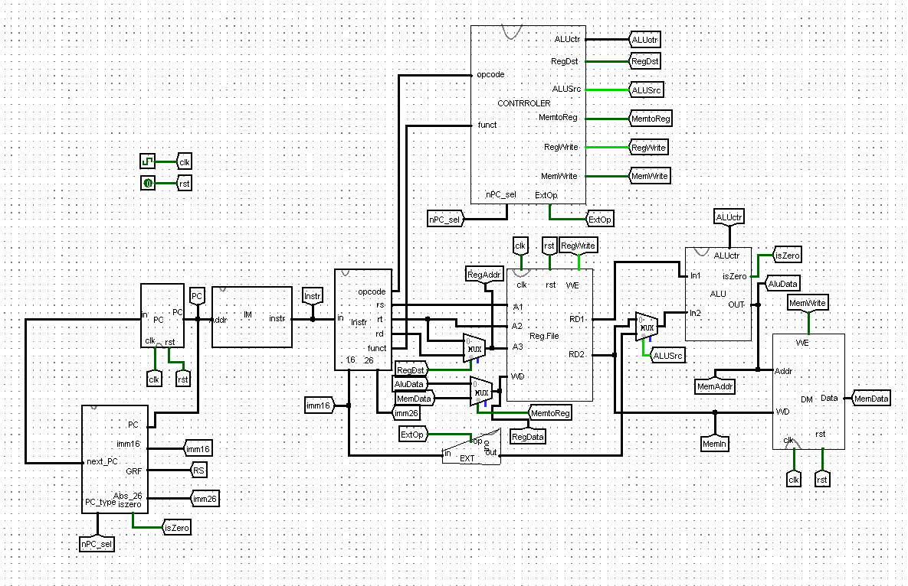
  
***
下面我将逐一介绍每个模块的具体的实现，第一个也是整电路运型的核心——**IFU**
***
  
### IFU模块
  
+ 内部包括 PC（程序计数器）、IM（指令存储器）、next_PC(PC状态转移模块)及相关逻辑。
+ PC的起始地址为：***0x00003000***
+ PC的地址范围为：***0x00003000~0x00006FFF***
+ PC程序计数用一个*32*位寄存器实现
+ IM指令存储器用一个**ROM**储存器实现
  
#### IFU整体模块外观
  
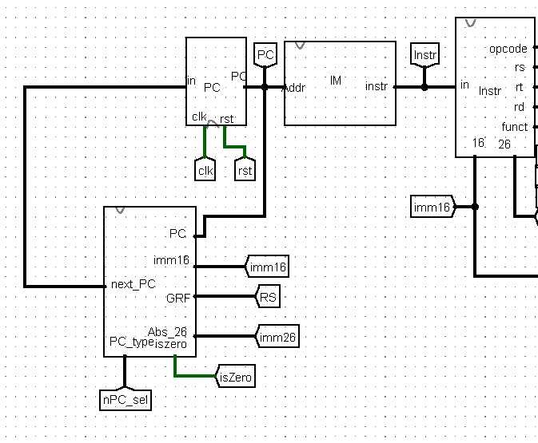
  
此**IFU**由三个核心模块组成（其实还有一个**Instr**模块，但我想**Instr**是如此的重要我想为其另立一个模块来谈它），包含了**PC**(记录状态)，**IM**（输出指令），**next_PC**(转态转移，这也IFU部分的核心模块)
  
#### PC
  
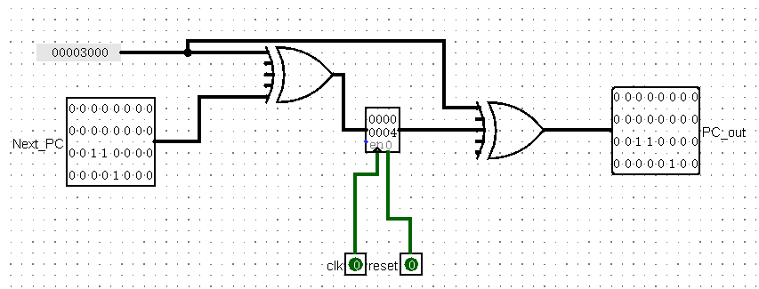
  
##### 模块变量
  
| 变量 |方向  | 位宽 | 作用 | 来源/去向 |
| ---   |---  |---   |---   |  ---   |
|clk   |  in  |  1   |时钟信号，上升沿触发|外部内置时钟信号|
|reset |  in  |  1   |**异步复位**| 外部复位信号|
|Next_PC|  in | 32   |即将进入PC寄存器的数据|**next_PC**的输出值|
|PC_out| out  | 32   |PC的输出数据|输入**IM**，提取指令|
  
##### PC解释
  
- 因为PC的起始地址是```0x00003000```,每次异步复位后的初始值都为`0x00003000`,所以可以在存入前异或一个数字**0x00003000**，在输出前再异或一次，这样就能保证**异步复位**的值是`0x00003000`了。
- 可以使用**加减法**达到同样的效果，但是**异或**显得更专业
- ***这个模块不管以后加什么指令，应该都不会再改变了。***
  
  
#### IM
  
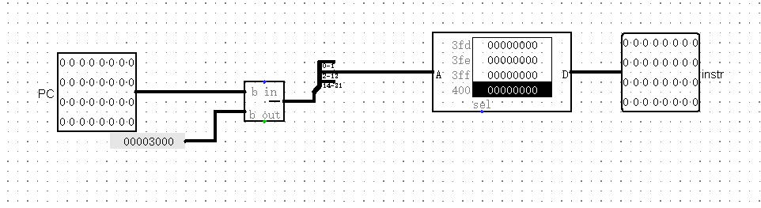
  
##### IM模块变量
  
| 变量 |方向  | 位宽 | 作用 | 来源/去向 |
| ---   |---  |---   |---   |  ---   |
|PC    |  in  | 32   |读取ROM内部的指令|来自**PC**的输出|
|instr  | out | 32   |这是32位机器码，也是控制的核心数据|送到**Instr**解析操作|
  
#### IM解释
  
- 因为**PC**的地址从`0x00003000`开始，而指令存储器是从`0x00000000`开始计数的，所以在开始时PC的数据要减去*0x00003000*。
- 因为每次读取 _32_ 位，即 _4_ 个字节，所以PC数据的前2位是没有的，地址范围为`0x00003000`~`0x00006FFF`,所以只需要PC的**12**个地址位便可以完全遍历ROM，所以在**PC**有效的数字为**2 ~~ 13**位。
- ***这个模块不管以后加什么指令，应该都不会再改变了***。
  
#### next_PC
  
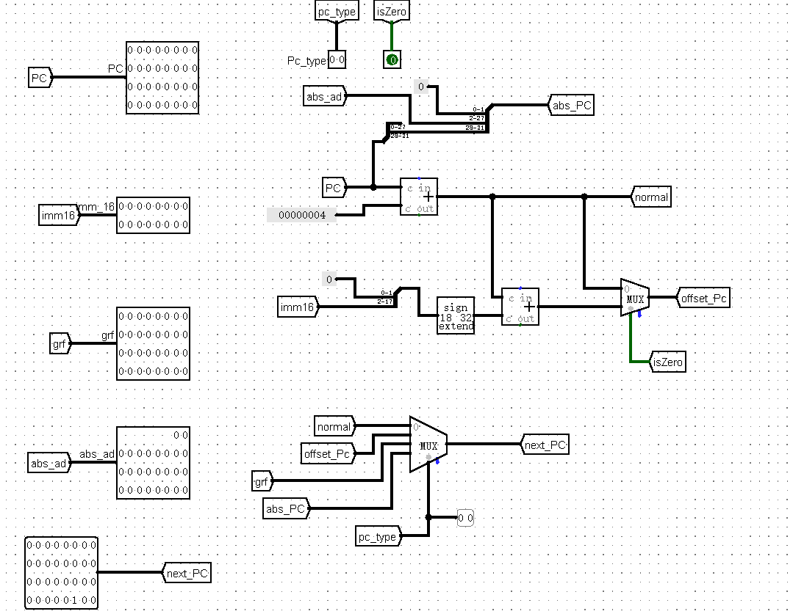
  
##### next_PC模块变量
  
| 变量 |方向  | 位宽 | 作用 | 来源/去向 |
| ---   |---  |---   |---   |  ---   |
|PC    | in   | 32   | 前一个转态**PC**的值，拥有偏移|来自**PC**的输出|
|imm16 | in   | 16   |`beq`等指令需要在原PC+4的基础上，偏移一个16位的立即数|来自于**Instr**解析后得到的输出**16imm**|
|grf   | in  |  32  |在类似`jr`的指令中，需要将GRF[rs]的值直接赋给PC|来自于GPR[rs]|
|abs_ad|in   |26   |在类似于`jal`的指令中，PC将会直接跳转到一个26位立即数|来自于**Instr**解析后得到的输出**16imm**|
|PC_type| in |2 |针对不同的寻址方式，给出相应的PC操作，如下方表格|来自于**control**模块确定**opcode**后确定寻址方式|
|iszero|in | 1|在`beq`指令中，需要相等时再偏移，iszero用于确定`beq`是否跳转|来自于**ALU**判断输入的两个值是否相等|
|next_PC|out|32|将下一个状态PC的值输出到**PC**中，用于状态转移|输出到**PC**|
  
***注意：后续可能需要考虑条件为">"、"<"等跳转指令，所以后续还需要从ALU中引出更多变量，"isbig" or "issmall"等***（英语不太好，想不到好的变量名） 
  
##### PC_type 解析
  
|值|对应的寻址方式|next_PC的计算方式|
|---|---|---|
|00|一般情况|_pc = pc + 4_ |
|01|相对寻址(`` `beq` ``)|_PC = PC + 4 + sign_extend(16imm)_|
|10|绝对寻址(`` `jr` ``)|_PC = GRF[rs]_|
|11|绝对寻址(`` `j` ``)|_PC = PC[31:28] [imm26>>2_]|  
  
`beq`等**imm16**扩展时是符号扩展（**sign_extend** not **zero_extend** ），有正负才能向上调与向下跳（~~我在这里栽了跟头，导致PC总是越界~~）。
  
##### next_PC解释
  
- 后续添加指令时需要从**ALU**引入更多变量，来确定跳转方式，为了应对`bge`、`blt`等指令
- 好好看看**mips**指令集，确定不同的跳转方式对于数据的处理，然后对应到PC_type
  
***
  
整个 ***IFU*** 模块就到这里了，这里是CPU的传感器，收集数据，由三个部分构成，构成了一个moore型的状态机，后续状态的改变方式将全部发生在**next_PC**模块中。（终于完成了一个子模块）
接下来是一个不必要但很方便的子模块...
***
  
### Instr
  
#### 电路实现
  
**instr**,将从**IM**中读取的指令解析成不同的部分分别送到不同的模块进行操作，算是一个过渡站。这个模块只由一部分组成，但是十分重要。
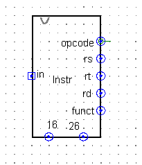
这是instr的外观，可以看到每个接口，下方是内部实现。
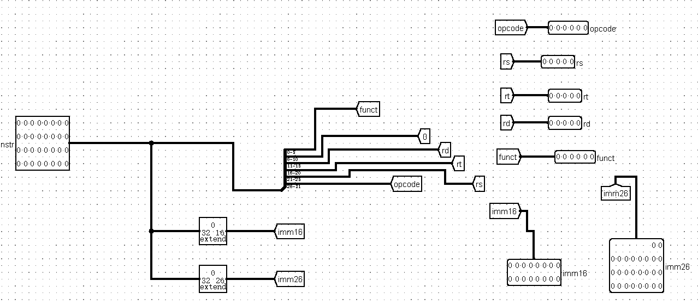
  
#### Instr模块变量
  
| 变量 |方向  | 位宽 |对应Instr的位置| 作用 | 来源/去向 |
| ---  |---  |---   |---   |  ---   | ----|
|Instr|in|32|0~31|承载着所有操作的信息|来自**IM**的输出|
|imm16| out | 16|0~15|获得Instr的低*16*位|在**next_PC**、**EXT**中，都需要用到这里的imm16|
|imm26|out | 26|0~25|在类似`` `j` ``指令中，需要一个imm26|**next_PC**需要一位imm26作为**abs_ad**|
|opcode|out|6|31~26|获取操作码|输出到**control**模块|
|rs|out|5|25~21|获取rs寄存器的数据，也是许多指令里的base|输出到**GRF**模块的 *A1*接口|
|rt|out|5|20~16|获取rt寄存器里的数据，有时也是将数据写入寄存器|连接**GRF**的*A2*与*A3*接口|
|rd|out|5|15~11|写入**GRF**模块中的寄存器索引（类似rt的第二个功能）|连接**GRF**的*A3*接口|
|funct|out|6|5~0|当opcode为0时的操作码（包括`` `add` ``、`` sub` ``等）|连接到**control**的*funct*|
|shamt|out|5|6~10|……|……|
  
如果你足够细心的话，你会发现*shamt* Tunnel连接出来了，但是并没有在子模块的输出中有作用，这是因为有一些指令类似于`` `sll` `` 与 `` `SRL` ``（右移与左移）等操作中需要用到*shamt*的这段数据，这里算为扩展代码铺了一点点底……
  
#### Instr解释
  
- *shamt*数据对应的是6~10位，以后扩展时记得设置一个输出。(不一定用上，所以我还没扩展)
- *imm16*与*imm26*的数据是用**extender**获取的，这是因为如果输入的数据比输出的数据多时，extender会自动**忽略高位**，也就是我们获取的是低*16*的数据。
  
***
**Instr**这样就完成了，但后续会扩展很多指令，可能还需要从这里传出更多的数据，因为这32位数字我们赋予了他们太多意义，所有电脑执行的操作都是由我们给32位数字赋予不同的意义开始的，充分利用这32位数字，我们能扩展的指令越多。
***
  
### GRF
  
**GRF**是我们进行操作的载体，我们可以将数据储存在这个寄存器堆中，然后用寄存器的地址(rs,rt,rd)找到这个寄存器，对其保存数据进行操作。有点类似于我们在C语言里的声明了一个变量*a*，这个*a*只是载体，也就是形参，而*a*的地址才是其真正的值。我们所操作的寄存器只不过是将数据暂时寄存存起来，*rs*，*rt*，*rd*只是对应了这个寄存器在寄存器堆里的地址，对应地址的寄存器储存的数据才是我们真正想要的。
  
#### GRF电路实现
  
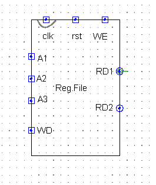
  
这是**GRF**的外观，看着很明了，各个接口的功能下方表格会提到。
  
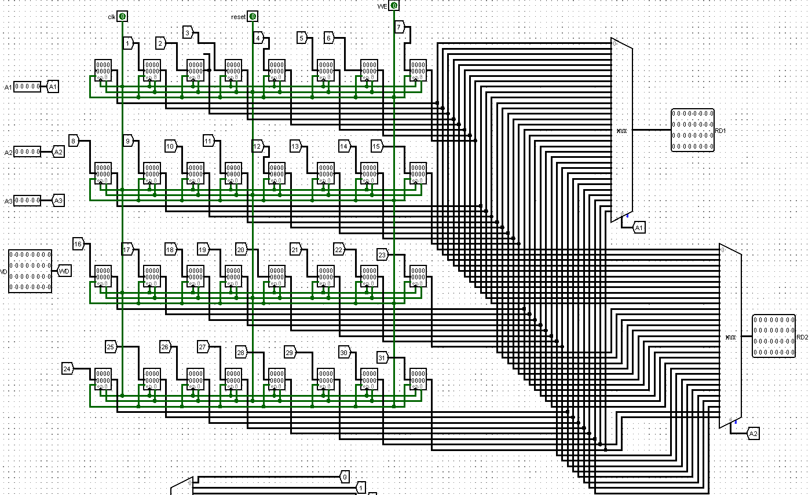
  
因为这里摆放了32个寄存器，所以显得很模糊，（我非常担心这里的哪个线路连接错了，因为实在是很难找到）
  
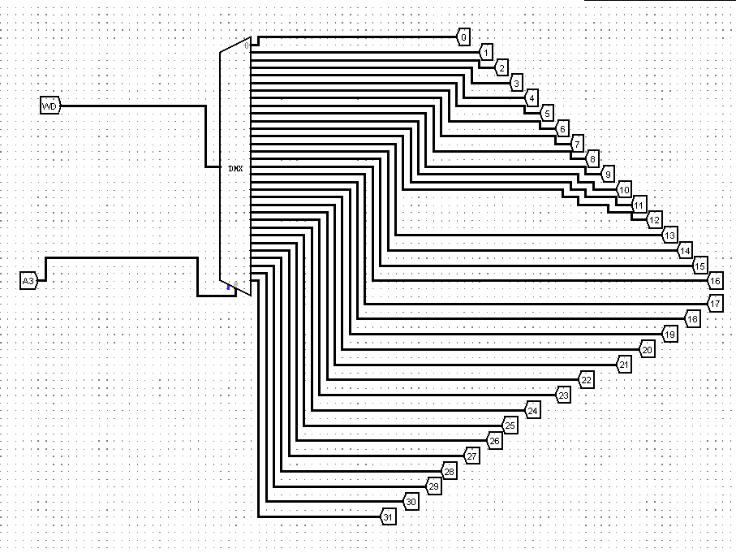
  
_A3*用于控制了数据存入那个寄存器，所以这里有一个DMX，值得一提的是，这个DMX的模块属性里的 <u> three_state? </u> 一定要选择 **yes**，这样其他寄存器的值就是高阻状态，即使没给其他寄存器写值，其他寄存器的值也不会改变了。
  
#### 模块变量
  
| 变量 |方向  | 位宽 | 作用 | 来源/去向 |
| ---   |---  |---   |---   |  ---   |
|A1 | in | 5| 获取rs里的数据，作为**ALU**的第一位操作数|**Instr**的*rs*|
|A2 | in | 5|获取rt里的数据，**有时候**作为**ALU**的第二位操作数|**Instr**里的*rt*|
|A3| in |5 | 将数据存储在*A3*所对应的寄存器里|来自*rt*或者*rs*，(根据**control**里的 *AlUsrc* 信号来判定)|
|clk|in|1|时钟信号|main函数的clk|
|reset|in|1|**异步复位**信号**|main函数的rst|
|WE|in|1|写入使能信号|**control**里的RegWrite|
|WD|in|32|写入数据|**ALU**的*ALUData* 或者 **DM**的*MemData*，(根据**control**的*MemtoReg*信号)|
|RD1|out|32|*A1* 对应寄存器的输出|输出到**AlU**，作为第一位操作数|
|RD2|out|32|*A2* 对应寄存器的输出|有时候作为**ALU**的第二位操作数，也作为**DM**的写入数据*WD*|
  
#### 解释
  
- 该模块是之前的作业题中搭好的，实现上理论没有问题，但是建议在搭好之后多调试一下(pre的测试强度太弱了啊)
- 寄存器因为有时钟信号，所以数据的存入总是慢一个周期，也就是说，执行完一条**Inst**r后写入的数据不能马上到对应的寄存器中，但是不用担心，下个时钟来临的时候，数据就存进去了。
  
***
  
我原本想把简单的模块先处理的，但是写**GRF**的时候我发现**control**模块输出的控制信号与整个CPU耦合度太高了，于是我决定赶紧把**control**模块处理了。
***
  
### control
这个模块分为两个主要的部分，一部分为对于*opcode*与*funct*的处理，一部分是在知道该执行什么操作后把对应的操作对应的各个控制信号传递出去。
所以这个模块我打算分为两部分来说：
  
#### 输入信号的处理
  
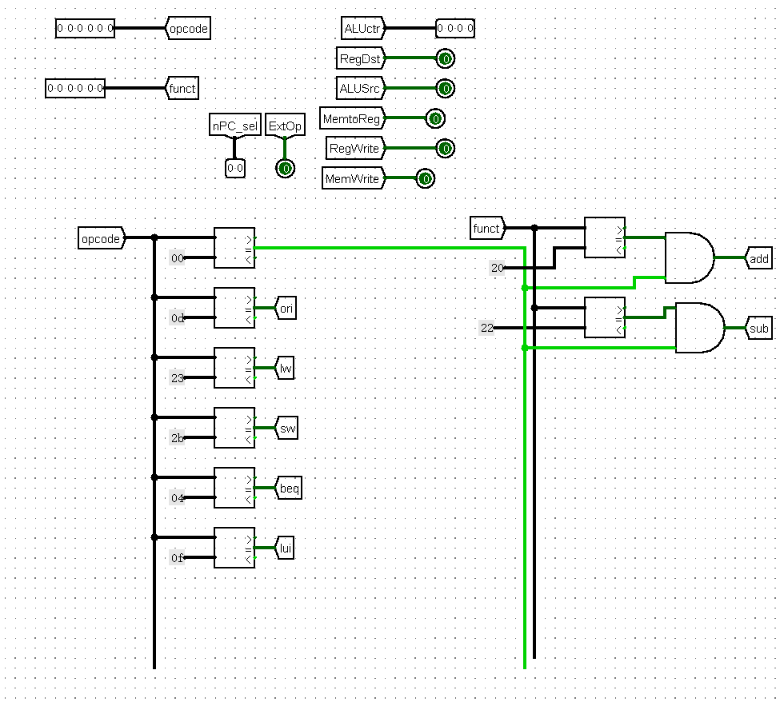
  
这里的输入数据很简单明了，不用立一个表格来说明了。
在判断操作时分为两种，一种是R型的操作，只有当*opcode*的值为0时才回去判断*funct*，另一种是直接用opcode得出对应的操作。
所以在后续添加操作时，防照上方，用比较器判断，在下方一一列好就行。`` `nop` ``指令不用管，就像他定义的那样，什么也不做。
  
#### 输出信号的处理
  
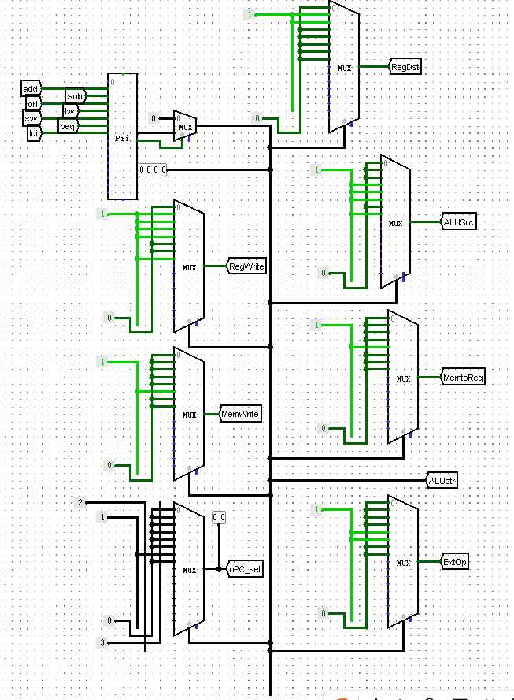
  
这里处理最好的地方便是很直观，用**译码器**将每一个操作翻译成不同的的编号（当不为上述的所有操作时,代表为`` `nop` ``，编号为0），然后用于控制后方不同的信号，因为每个操作的编码都是唯一的，于是我们可以用**MUX**来控制输出信号。（比如RegDst,从上到下的次序与左边一致，`` `add` `` 、`` `sub` ``……，因为**MUX** 的第一位为 _1_，你就可以直观地理解为当操作位`` `add` ``时，RegDst信号为1，其余的统统类似），这里如此多的控制信号我必须建一个表格来说说。
  
|信号名|位宽|作用|
|---|---|---|
|RegDst|1|当RegDst = 0时，**GRF**模块的 _A2_ 选择 _rt_,当RegDst = 1时，**GRF**模块的 _A2_ 选择 _rd_|
|RegWrite|1|连接**GRF**的 _WE_ 接口，当RegWRite = 0时，不能向**GRF**里写入数据，当RegWrite = 1时，能向**GRF**里写入数据|
|ALUSrc|1|当ALUSrc = 0时，**ALU**的第二个操作数来自 _GRF[rt]_，ALUSrc = 1时，**ALU**的第二个操作数来自**imm16**扩展为 _32_ 位后的立即数（具体的扩展方式由ExtOp决定）|
|MemWrite|1|连接**DM**的 _WE_，写入使能，作用与RegWrite类似|
|nPc_sel|2|确定**next_PC**模块中的寻址方式，具体内容如上方**PC_type**表格所示|
|ALUctr|4|目前不知道要加多少操作，所以先选了 _4_ 位，这个数据传**入ALU**后，**ALU**的输出端会输出对应的值，具体值可以在**ALU**模块中查看|
|ExtOp|1| _imm16_ 扩展为32位，当ExtOp = 0，为无符号扩展，当ExtOp = 1，为符号扩展(当执行到`` `beq` ``时,ExtOp = 0,因为在next_PC内部已经符号扩展了)|
|MemtoReg|1|当MemtoReg = 0时，写入**GRF**的数据来自**ALU**的输出结果--ALUData，当MemtoReg = 1时，写入**GRF**的数据来自**DM**的MemData|
  
#### 解释
  
- 这样就把输入和输出的信号处理好了，这里是CPU的指挥中枢，目前为止的控制信号已经多达七个。
  
- 除了ALUctrs是自己定义的外，其他的信号控制都要严格按照MIPS指令集来控制，这里不属于自定义的范畴。
- 把**control**的每个信号搞懂之后就能搞清楚整个CPU了，所以在加入操作时对于这里的处理一定要细心，大多数的出错会集中在这里。
  
***
  
与**control**紧密联系的是**ALU**，所以下一个模块就介绍**ALU**了吧（~~写了很久，已经麻了~~）
  
***
  
### ALU
  
#### 电路实现
  
**ALU**是执行操作的地方，所有数据完成的加减乘除都要在这里中转(尽管目前我乘除还没有加入)
  
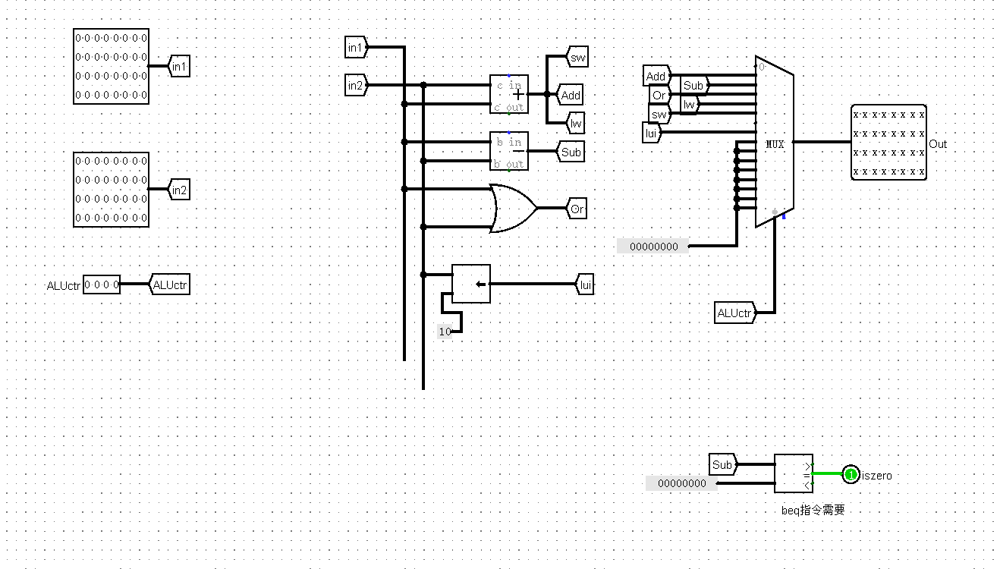
  
这个图看着相当的直观明了，但是注意，一定要把对应的操作和其对应的输出对应好(毕竟**MUX**容易看走眼了)
看到右下角的 _iszero_ 了吗，还记得之前**next_PC**哪里也有 _iszero_ 吗，没错他们是同一个，用于`` `beq` ``判定时是否跳转（这样处理的话加入以后出现bge时，可能还需要添加isbig，issmall之类的）。
  
往后再添加新指令时，只需要在**ALU**中进行相应的操作就好。
  
***
  
### Ext
  
这是最简单的一个模块，被很多人评价为可有可无，但是本着全覆盖的原则我还是要提一下：
  
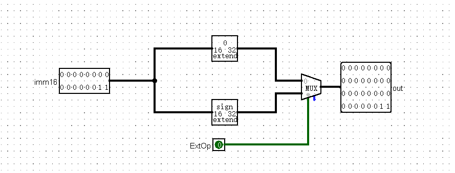
  
|信号|位宽|作用|来源|
|---|---|---|---|
|imm16|16|用于扩展的立即数|来自**instr**的 _imm6_|
|ExtOp|1|0：无符号扩展；1：符号扩展|来自**control**的ExtOp|
|out|32|输出的32位立即数将作为参与ALU运算的第二个操作数（具体看 _ALUSrc_信号）|去到**ALU**的 _in2_ |
  
这样ExtOp就设计完了，需要主要看新添指令时，指令的16位操作数要进行哪个类型的扩展，这很重要。
  
***
  
最后一个模块了，还剩**DM**!
  
***
  
### DM
  
前面铺垫了那么多，相比对于**DM**是什么都能大概猜到了，没错它是一个RAM存储器，也就是我们经常说的真正的地址，大量的数据都会被保存在地址里，而与RAM有交互的指令只有`` `sw ` ``与`` `lw` ``（这是很庆幸的，意味着以后加的指令都用于跳转和寄存器的数据之间的计算，**DM**模块可以不用那么在意了）
  
#### 电路实现
  
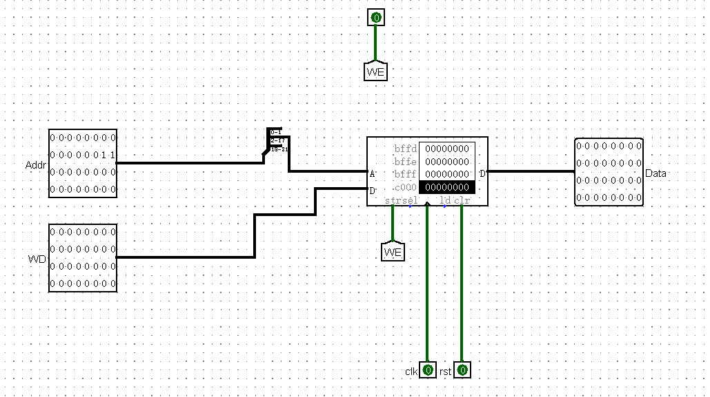
  
如图所示，每个控制信号也都很清晰，来源之前也说过了(_Addr_ 来自**ALU**的_out_ 接口，WD来自于**GRF**的WD2)。
在这里值得一说的是**DM**模块的数据只与**GRF**做交互，也就是`` `sw` `` 与`` `lw` ``,地址位通过ALU的计算得来。
但是我们只需要16位地址位，而且每次存入的都是 _4_ 字节，所以前两位不要，只取**2~17**位。
  
注意：关于**DM**的两个数据，课程要求的是写入数据位**MemData**，但是我定义的是写入的数据（也就是 _WD_ ）位**Memin**，而输出的数据（也就是 _Data_ ）为MemData。
  
___
  
就这样我们把全部的逻辑都说完了，搭CPU是一件这样的事情………我觉得到这里我们有必要回顾一下整个电路，他们之间发生了什么
  

  
现在是不是很了然了，尽管我对我课上的试验仍然没有自信，但尽力而为吧。
  
***
  
## 思考题
  
1.上面我们介绍了通过 FSM 理解单周期 CPU 的基本方法。请大家指出单周期 CPU 所用到的模块中，哪些发挥状态存储功能，哪些发挥状态转移功能。
  
    状态储存：IFU(PC,next_PC,IM),储存了当前状态的指令
             GRF，储存了写入寄存器的数据
             DM ,储存了写入地址的数据
    状态转移：control，判定opcode后进行各种控制信号的输出控制状态
            ALU；通过计算数据并将数据存入GRF与DM
2.现在我们的模块中 IM 使用 ROM， DM 使用 RAM， GRF 使用 Register，这种做法合理吗？ 请给出分析，若有改进意见也请一并给出。
  
    合理。
    ROM无需也不能再执行的过程中更改，所以要执行的操作都提前存进去的，符合IM的要求。
    RAM存储空间大，有读入有读出，适合当作地址。
    Register有存储数据的功能，只有在上升沿时才数据才会发生改变，与PC周期一致，
    所以数据能完美匹配PC执行的操作，而且32个分开的存储器能同时执行读入与读出。
  
3.在上述提示的模块之外，你是否在实际实现时设计了其他的模块？如果是的话，请给出介绍和设计的思路。
  
    设计了一个Instr模块
    这个模块是对IM模块中输出指令进行解析，将不同的结果传递给不同的模块。
    如opcode与funct传送给control模块，rs,rt,rd传递给GRF模块
    imm16传递给ExtOp模块与ALU模块，imm26传送给PC模块
  
4.事实上，实现 nop 空指令，我们并不需要将它加入控制信号真值表，为什么？
  
    虽然我不是用真值表的方式实现的指令，但是原理是一样的。
    当出现nop指令时，在我的操作中对应的是0000，每个控制信号都是0，也就是说，nop指令不会对外界做出任何的改变。
  
5.阅读 Pre 的 “MIPS 指令集及汇编语言” 一节中给出的测试样例，评价其强度（可从各个指令的覆盖情况，单一指令各种行为的覆盖情况等方面分析），并指出具体的不足之处。
  
    指令覆盖情况：缺少sub指令
    单一指令覆盖缺陷：sw、lw：没有考虑偏移量为负的情况，imm16为符号扩展
                    beq：跳转指令只有向下，应该涵盖向上跳转
    整体：测试只能通过最终看每个寄存器的位置与MARS里寄存器里的数据是否相同，不能实时追踪每个寄存器的正确性，可能不够严谨。
  
### 测试方案
  
综合目前实现的指令，我编写如下的MARS测试代码，再将汇编语言转为机器码导入到CPU，进行对拍，尽量覆盖可能出现的情况。
  
    #ori
    #考虑赋值为0，正负数的情况，以及赋值给有值的寄存器与为0值的寄存器（考虑0号寄存器不可以被赋值）
  
    lui t0, t1,0x1234
    ori t1,0xffff
    ori t4,0x0000
    lui t2,0x1234
    lui t0,0xffba
    addu t0,t2,0xfeda
    addu t2,t0,t1,t3,t1
  
    #正数+正数
    lui t1,t4,t1
  
    #负数-负数
    lui t1,t0
    lui t3,t1
  
    #负数减正数
    ori 0,0xfffc
    ori 0,0x1111
    subu t0,t2,0xfeda
    ori 0,0x111
    subu t1,0赋值
    #base的值可以为0，也可以为正负
    lui s0 s0 0x0000(s0 0x0004(s0 0x0200(t0 0x0000(t1 0x004(t2 0x0200(zero 0x0000(s0 0x0066
    ori s0 0xccff
    ori zero 0x0100
    sw t0)
    sw t0)
    sw t0)
    sw t0)
    sw t0)
    lw t0)
    lw t0)
    lw t0)
    lw t0)
    lw t0)
  
    #beq
    #需要考虑可以前后跳转以及不相等
      beq 0,lable2
    ori t0,0,t3,0x1344
  
    lable2:  ori 0,0xffff
    ori s2,0x1111
    beq s2,lable1
  
  